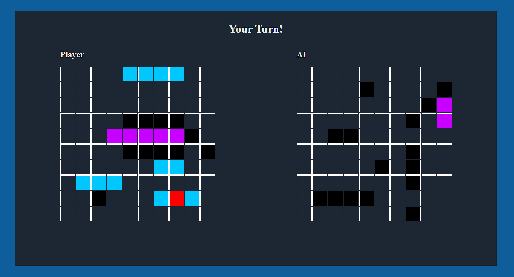

# Battleship

Play the classic game of battleship in the browser against a computer opponent

Built as part of [The Odin Project](https://www.theodinproject.com/) curriculum to practice **DOM manipulation** and **test driven development techniques using Jest**.

## Features

- Ship placement and gameboard management
- Turn-based combat
- Test-driven design

## Demo

### [Live Demo](https://songzhang015.github.io/project-13-battleship/)

## Built Using

- HTML
- CSS
- Javascript
- Jest
